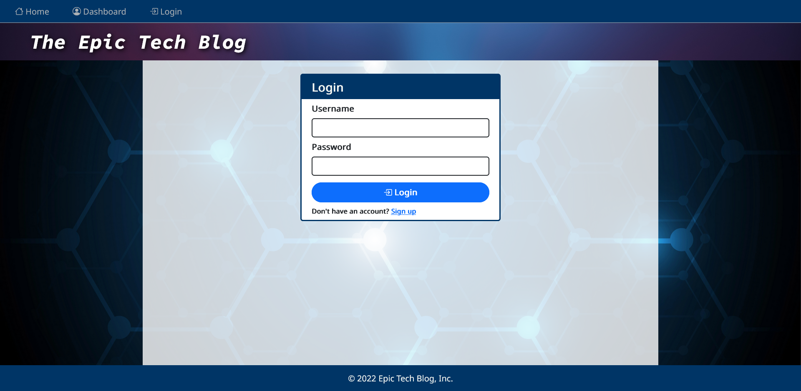
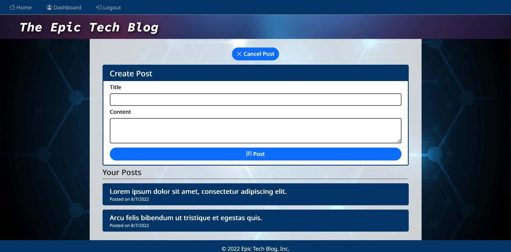

# Tech Blog
[](https://opensource.org/licenses/MIT)

## Description

For this project, I built a CMS-style blog site using the Model-View-Controller (MVC) paradigm as well as technologies such as express-handlebars, dotenv, bcrypt, express-session, and connect-session-sequelize. The Tech Blog allows a developer to publish blog posts and add comments to other developers' posts. making it easier to exchange and discuss new ideas and opinions about the tech industry. Developers can create an account on the site and make posts and comments, view posts created by them on their dashboard, and edit and delete posts. Building the blog site helped me to understand the importance of the separation of concerns and the usefulness of authenticating users and protecting api routes.

## Table of Contents

* [Installation](#installation)
* [Usage](#usage)
* [Screenshots](#screenshots)
* [Technologies](#technologies)
* [Credits](#credits)
* [Links](#links)
* [License](#license)

## Installation

To install this application on your local machine:
- Clone the application's repository and place it into a local directory on your computer.
- Ensure that your computer has node.js installed. To check the current version installed, type:
```
    node -v
```
- Ensure that MySQL is installed on your computer.
- Open a command-line interface (VS Code, Git Bash, etc.) and navigate to the directory containing the application's server.js.
- In the command-line, download the application's dependencies by typing: 
```
    npm install
```
- Create an .env file in the root directory and input the following into the file while using your own username and password:
```
    DB_NAME='tech_blog_db'
    DB_USER='your_username'
    DB_PASSWORD='your_password'
```
- Type the following command into the terminal to start the MySQL Shell. When prompted, input your password for the MySQL Shell to connect to the database.
```
    mysql -u root -p 
```
- While in the MySQL Shell, create the database by typing: 
```
    source db/schema.sql
```
- To exit the MySQL Shell, type:
```
    quit
```
- To seed data into the database, type:
```
    npm run seed
```

## Usage

- To start the server, type the following command:
```
npm start
```
- While the server is running, open a web browser and navigate to http://localhost:3001/
- On the homepage, existing blog posts will be displayed. To view a blog post's comments, click on a blog post's title.
- To create posts and add comments to other posts, click on the login link. Existing users can log into the site using their username and password. New users can switch to the sign-up form to create their account.
- A user's dashboard allows them to create a new post, view the posts they have created, and edit and delete any of their existing posts.
- Users that are logged in are able to add comments to other blog posts by clicking on the post's title and filling out the comment form.
- To log out of the site, click the logout button on the navigation bar at the top.

## Screenshots

The following images demonstrate the application's appearance and functionality:







## Technologies

- express
- express-handlebars
- MySQL2
- Sequelize
- dotenv
- bcrypt
- express-session
- connect-session-sequelize
- Bootstrap 5
- Google Fonts

## Credits

- [kt946](https://github.com/kt946)

## Links

- [Link to deployed application on Heroku](https://sheltered-mesa-54132.herokuapp.com/)

- [Link to GitHub repository](https://github.com/kt946/tech-blog)

## License

This application is covered under the [MIT](https://opensource.org/licenses/MIT) License.